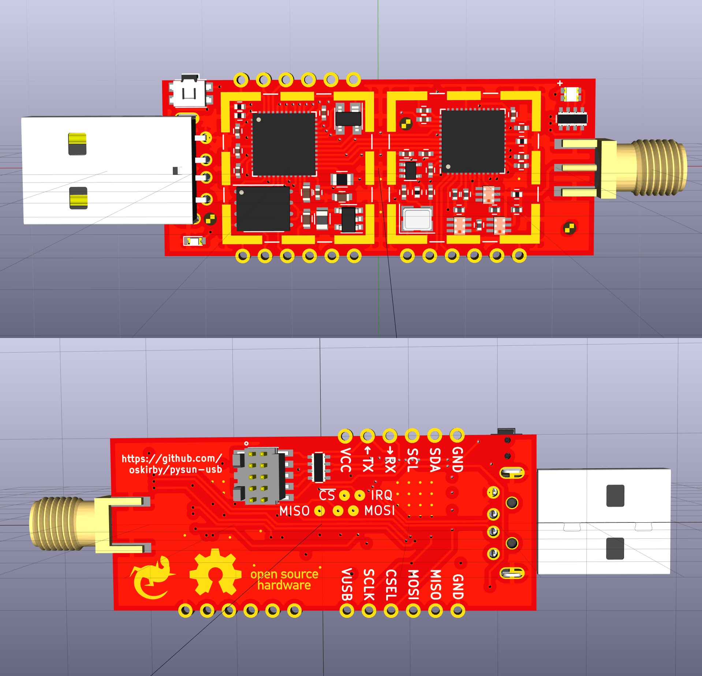

PySUN-USB
=========
The PySUN is a USB dongle for IEEE 802.15.4 Smart Utility Networking protocols. This project is based around
an STM32F4-series microprocessor and the Atmel/Microchip AT86RF215 dual-band IEEE 802.15.4 transceiver. This
board also supports a Micropython programming environment. The two RF bands from the transceiver are combined
into a single antenna port using an RF diplexer.

This board is released as an Open Source Hardware project, including the full PCB design files from KiCAD.

Features
-----------
Attached to the STM32F4 microcontroller, are the following peripherals:
* AT86RF215 connected to SPI2.
* 32Mbit SPI flash connected to SPI1.
* RGB LED connected to PB0, PB1 and PB10.
* Tactile switch connected to BOOT0 and PB7.
* Power/status LED connected to PB6.

Castellated edges are provided, exposing:
* SPI1
* I2C1
* USART1
* RF215 FEA and FEB outputs

Power is provided by a 2MHz synchronous buck regulator and the clock reference is provided from a 26MHz TCXO.